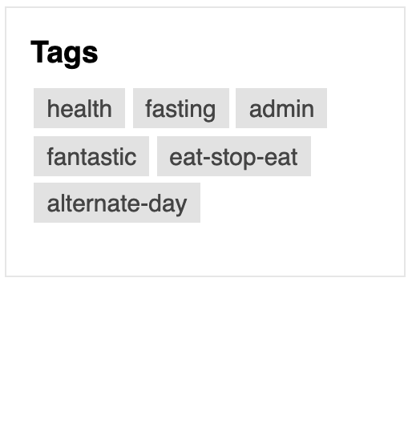
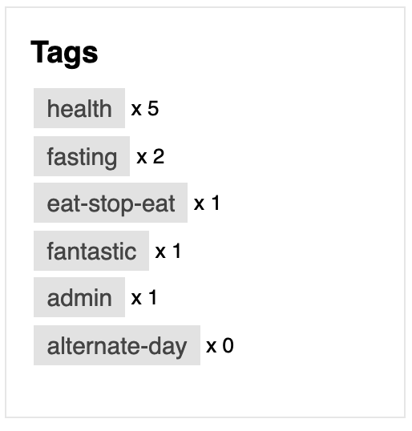

# 🏷️ Layouts Tag List Widget

## 🔍 Overview

The Tag List Widget allows you to display tags from Discourse in a sidebar using Pavilion's [Custom Layouts Plugin](https://meta.discourse.org/t/custom-layouts-plugin/55208) or Discourse's Right Sidebar Blocks Component. See the [installation guide](https://thepavilion.io/t/installation-and-setup/3200) to learn how to install and administer this widget.

> ⚠️ **Please ensure that you have tagging enabled in your Discourse settings for this widget to work.**

## 🔗 Info &amp; Links

| Title                 | Link                                                                              |
| --------------------- | --------------------------------------------------------------------------------- |
| ⚙️ **Widget**         | [Layouts Tag List Widget](https://github.com/paviliondev/layouts-tag-list-widget) |
| 🔌 **Base Plugin**    | [Custom Layouts Widget](https://meta.discourse.org/t/custom-layouts-plugin/55208) |
| 👨‍💻 **Author**         | [Keegan George](https://github.com/keegangeorge/), [Merefield](https://github.com/merefield/)|
| #️⃣ **Version**        | `1.2.0`                                                                           |
| ❓ **How to Install** | [Installation Guide](https://thepavilion.io/t/installation-and-setup/3200)        |
| 🐛 **Found a bug?**   | [Submit a bug report](https://thepavilion.io/w/bug-report/steps/intro)            |
| ✋ **Have an idea?**  | [Submit a feature request](https://thepavilion.io/w/bug-report/steps/intro)       |

## ⚙️ Settings

There are a couple settings that you can configure to customize how the tag list widget appears in the layout.

### 🙈 Hidden Tags

Select tags from the dropdown you wish to have hidden from the sidebar.

### 📄 Display Style

Select between a column or row style layout to display your tags.

| Column                               | Row                             |
| ------------------------------------ | ------------------------------- |
|  |  |

### #️⃣ Show Count

Toggling this setting will display the number of topics for each tag beside the tag item.

### 📶 Sort Type

Select the manner in which tags should be sorted.

Options include:

- Count Ascending
- Count Descending
- Alphabetical Ascending
- Alphabetical Descending
